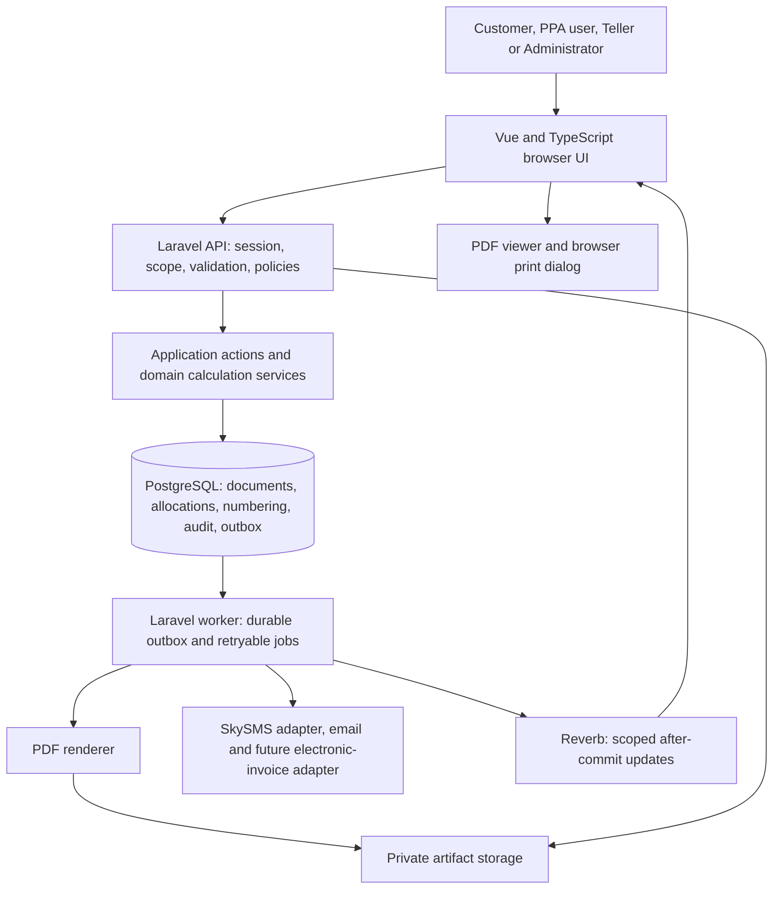

# Proposed online architecture

Status: LIFECYCLE, DOCUMENT-STUDIO, PRICING, REGISTRATION, PWA, COMMUNICATION AND DOCUMENT-HISTORY DESIGN APPROVED, 2026-09-19; other proposals retain their status in the [decision register](../README.md). W20-W35 are the accepted workflow baseline. The existing scaffold is separate from these unimplemented domain contracts; design approval does not satisfy phase, fiscal, privacy, security or provider-review gates.

## 1. System boundary



The application and worker share the same codebase. A renderer process is an implementation detail, not a second financial authority. Browser clients never connect directly to PostgreSQL. Rendering, SMS, email and external submission occur after financial commit.

Recommended initial deployment: Vue static assets and Laravel behind one HTTPS origin; PHP application, scheduled task runner, and queue worker; managed PostgreSQL and private object storage. Choose host, versions, sizing, and renderer platform during the first prototype. Redis is optional until queue/cache load justifies it; neither Redis nor browser state is the source of balances or document numbers.

Development update, 2026-09-17: Docker PostgreSQL and Redis are now isolated in the project's Compose stack. Laravel Reverb is planned as an application process for private UI notifications after the Laravel scaffold exists. Redis/Reverb are never posting authorities. See [development setup](DEVELOPMENT.md) for ports, lifecycle, and after-commit/reconnect rules.

W27, clarified 2026-09-19, selects Laravel Reverb as the shared realtime layer wherever the app benefits from instant data updates, including chat and notifications. Queue/worklist changes, bill/OR readiness, tax/payment review, confirmed balances and relevant admin changes can publish scoped events after commit. Persist business state, messages, notification recipients/unread state and outbox events in PostgreSQL; authorized clients refresh affected API data. Reconnect reads durable API state. The [customer service lifecycle](discovery/CUSTOMER_SERVICE_LIFECYCLE.md) defines event selection, queue fairness, tax evidence, payments and correction decisions.

W31, approved 2026-09-19, adds a SkySMS adapter for eligible Customer/VIP transactional messages. It consumes committed notification intents from the outbox, uses verified contacts and versioned templates/policies, and records local/provider status independently of financial state. The normal SkySMS send contract has no documented idempotency key or webhook, so timeout/ambiguous results reconcile rather than blind retry; `sent` is not reported as delivered. P4-03's Communications Operations dashboard is a separate, read-only aggregate of scoped status/event counts; it contains no recipient/message/provider identifier, financial value or provider action. The [SMS notification contract](discovery/SMS_NOTIFICATIONS.md) owns provider-specific limits, template safety, privacy/contact and activation gates.

W32 adds required customer registration identity/contact capture: full name, company / registered buyer name, email and mobile. Portal user, customer business account, verified contact and buyer-profile version are separate records. A mobile OTP is a purpose-bound security verification flow, not a W31 template/delivery. Invoice/receipt posting snapshots the reviewed buyer/payer identity; a later profile edit or contact verification cannot rewrite issued artifacts. See [customer registration](discovery/CUSTOMER_REGISTRATION.md).

W33 makes the Vue application PWA-ready without changing the online-only financial model: only a controlled static app shell may be cached; API/auth/CSRF/OTP/artifact/customer-data requests remain network-only. W34 adds durable organization-scoped Admin in-app announcements with after-commit Reverb wake-ups and authorized API recovery; it is not SMS, web push or a financial state. W35 adds immutable document revisions and append-only audit history for edits, approvals, corrections, reversals and artifact/access events. See [PWA readiness](discovery/PWA_READINESS.md), [announcements](discovery/ANNOUNCEMENTS.md) and [document history](discovery/DOCUMENT_HISTORY.md).

## 2. Module ownership

| Module | Owns | Boundary |
| --- | --- | --- |
| Identity and Access | Users, memberships, named permissions, sessions | Every command, list, export, file download, and worker job enforces organization/location scope |
| Customer Identity | Customer business accounts, buyer-profile versions, explicit user-account authority links, verified email/mobile contacts, registration/claim security challenges | A matching company/contact is only a review signal; mobile OTP proves possession, not business/fiscal authority. Snapshot buyer/payer identity for issued documents. |
| Configuration | Allowlisted organization/location application settings, branding and printer profiles | Does not own secrets, rates, numbering, accounting periods, template versions, or other domain-authoritative rules |
| Customer Requests | Requirement-set versions, request files/reviews, service queue tickets and teller assignment | Automatic admission after complete safe submission; oldest eligible claim; retain original priority through corrections; transaction/ticket IDs are not fiscal numbers |
| Customer Tax Evidence | Withholding certificates/eligibility, exemption evidence, review decisions and treatment coverage | Supplies validated versioned facts to fiscal calculation/settlement; no unrestricted discount or customer-wide exemption flag |
| Master Data and Pricing | Customers, services, cargo/tariffs, vessels, banks, effective-dated tariff/tax/PPA/fuel rules and fuel-price observations | Server resolves versioned line classifications and transparent charge components; changes affect future calculations only |
| Billing | Invoice drafts/items, posting, invoice lifecycle | Owns invoice amounts; invokes Numbering and Pricing within posting |
| Fiscal Compliance | Taxpayer/branch fiscal profile versions, fiscal validation rules and retention holds | Validates issuance through Billing; no duplicate balances. Separates principal invoice, collection and electronic reporting. Registration/approval workflow is external; see W19 |
| Receivables and Receipts | Receipt drafts, tenders, allocations, reversals | Owns settlement; locks invoice balances through a shared application action |
| Customer Credit | VIP eligibility, credit/late-charge policies, invoice credit assignments, exposure, aging, late-charge assessment and waiver/reversal | Charging preserves original invoice debt; late charges are separately linked receivable events; settlement reuses receipts/allocations; terms/policies snapshotted; scoped account locks enforce limits |
| Customer Payments | Customer bill lookup, payment attempts, provider confirmation, uploaded proof and teller review | Customer ownership required; confirmed sources call the shared receipt action; checkout returns and uploads alone cannot settle a bill |
| PPA Verification | Scoped current-payment verification and check audit | Reads effective settlement; cannot post payments or approve proofs; formal clearance is a separate unconfirmed requirement |
| Conversations and Notifications | Conversation participants, durable messages, unread notifications, verified contact/preferences, SMS template/policy versions and delivery/status effects | API-scoped access and after-commit Reverb/SkySMS outbox; each operational SMS event retains its source location scope. A Teller may see only state for assigned locations, while rendered message/provider details require a separate permission; the separate P4-03 aggregate reports only scoped status/event counts and never a recipient/message/provider identifier or financial value |
| Announcements | Versioned maintenance/important-information notices, scoped audience and per-user seen/acknowledge/dismiss state | After-commit Reverb only wakes an authorized API refresh; every read/mutation/authoring request stays inside the actor organization, publishing does not send SMS/e-mail/push or mutate a financial record |
| Numbering and Periods | Document series/register, accounting periods, backdate authorization | Allocates inside the caller's transaction; business date is distinct from recorded timestamp. A posted invoice/receipt retains its resolved period and any consumed one-use authorization |
| Approvals and Audit | Requests, decisions, execution reference, append-only audit events and security events | Approval alone does not mutate documents; execution calls the owning module's action. History records actor, scope, reason, versions, before/after values and related command IDs |
| Document History | Draft revisions, field/line diffs, immutable snapshots, correction/reversal chains and access/artifact events | Drafts use optimistic versions; issued financial records are never overwritten or deleted; authorized users see only their permitted history |
| Documents and Printing | Admin Document Studio drafts/validation/publication/activation/retirement, immutable render payloads, artifacts, print attempts | Receives finalized values; templates cannot calculate authoritative amounts, query SQL or alter fiscal identity. Retirement preserves layouts/artifacts and cannot remove a current or future issuance route |
| Statements and Transmittals | Statement snapshots plus explicit yellow-invoice/white-receipt transmittal memberships | Statements are immutable as-of receivables communications. Transmittals lock and freeze selected `POSTED` source facts as of a date, use non-fiscal references, and never settle invoices/receipts or infer legacy white-transmittal tax/income classifications |
| Reporting and Integrations | Read projections, exports, submission attempts | Reads authoritative records; integration status never implicitly changes payment status |

Use controllers -> validated requests and policies -> application actions -> domain services and Eloquent/query builder. Keep business rules out of controllers, Vue components, model observers, and queue handlers. Actions may coordinate several modules in one database transaction. Do not create generic repositories for every table without a concrete need.

Suggested domain layout within the existing application scaffold (domain directories are not yet implemented):

```text
apps/web/src/features/{admin,customer,ppa,billing,receipts,approvals,templates,reports}
apps/web/src/{components,api,router}
apps/api/app/Modules/{Identity,Configuration,Billing,Receivables,Pricing,Numbering,Documents,...}
apps/api/database/{migrations,seeders}
apps/api/tests/{Unit,Feature,Integration}
contracts/openapi.yaml
docs/{decisions,workflows,operations,migration}
```

## 3. Financial invariants

1. Server-calculated amounts are authoritative. Vue may preview values but posting recalculates and checks draft/rate versions; changed rates return a conflict for review, not a silent price change.
2. Use PostgreSQL `numeric` for amounts, quantities, and rates; use a decimal arithmetic library in PHP. JSON amounts are decimal strings. Never cast accounting values to PHP floats or rely on JavaScript numbers for final totals.
3. Starting schema candidates are `numeric(20,2)` for finalized amounts and `numeric(20,6)` for quantity/rate; confirm scale and limits from real data before migrations. Calculation intermediates retain sufficient precision. Explicitly truncate/round at the established workflow stages before persistence.
4. Preserve customer, description, rate, tax, withholding, discount, PPA, route, and rule-version snapshots. Master-data edits cannot rewrite issued documents.
5. Post invoice header, items, number registration, document snapshot/template selection, audit, and outbox atomically. Receipt posting likewise commits tenders and allocations together.
6. A posted allocation cannot exceed the locked collectible balance or the receipt's supported settlement amount. Cash, withholding, discounts, and other non-cash settlement components are separate amounts with documented equations; do not treat all as money received.
7. W26 approves immutable issued invoices and linked correction under W07. Exact fiscal adjustment and broader receipt-reversal policies still require review. Reversals reference the original event; they do not delete it. Outstanding balance is reproducible from posted amounts and effective settlements/reversals.
8. Preserve ten-digit legacy numbers as strings. Internal primary keys are separate from printable identifiers.
9. Financial status does not depend on printing. A browser print request is not confirmation that paper was produced.
10. All write retries are idempotent; authorization is checked again even when returning a previously stored result.
11. W19 fiscal compliance is a core posting/output constraint, not only an optional integration. Service sales on credit still require the applicable invoice; collection and VIP credit assignment do not issue another sale. Payment terms do not change fiscal recognition. See [BIR_COMPLIANCE.md](BIR_COMPLIANCE.md) for official sources, applicability and proposed controls.
12. W29 pricing resolves a tariff version, tax treatment, PPA rule/result, fuel schedule/price band, calculation basis and amounts on the server. Store these line/component snapshots atomically; a Document Studio layout or later policy update cannot recalculate an issued bill.
13. W30 late charges are separate, immutable VIP receivable/adjustment events keyed to a captured credit-policy cycle. They never overwrite the original invoice, reset its aging, become a withholding/discount component, or arise only because a payment instruction expired. Their fiscal/accounting treatment requires the P0-06 matrix.
14. W31 notification intent is committed with its owning business event, but external SMS delivery is an independent after-commit effect. Provider states, preference suppression, delivery failure, retry and reconciliation never alter invoice, receipt, payment, credit, PPA or document-artifact state. Preserve the selected contact/policy/template/render snapshot, local effect key and immutable source-location scopes; a provider timeout is not permission to duplicate-send. Unscoped account-level events are Administrator-only until an authoritative location mapping exists, and a delivery-list permission alone never exposes rendered customer content or provider identifiers.
15. W32 keeps portal identity, customer account, verified contact and buyer-profile version separate. A registered full name/company/e-mail/mobile or OTP result does not by itself prove fiscal buyer identity or account-wide authority. Invoice posting captures the reviewed buyer profile/version and field snapshot; receipt posting captures the applicable payer/buyer snapshot. Profile/contact edits affect future drafts only.
16. W33 PWA caches never become an authority: the service worker may serve an approved static shell but cannot cache/replay protected API responses, credentials, OTP, artifacts or financial commands. Offline mode disables authoritative actions and reconnects through normal API authorization.
17. W34 announcement publish/retire and per-user acknowledgement are non-financial, organization-scoped audited events. A Reverb notification is a hint to refetch authorized API state and cannot expose a broader audience or grant a user access.
18. W35 requires every document mutation to create an append-only revision/audit event in the owning transaction. Draft edits retain before/after snapshots and optimistic versions; posted invoices, receipts, allocations and related financial facts use linked corrections/reversals. Failed commands cannot create a false successful history entry, and later template/profile/settings changes cannot rewrite issued snapshots.

Legacy compatibility fixtures must cover the 25th/26th period boundary, December exception, domestic/foreign routes, VAT/PPA switches, `XXXX` marker handling, danger/fuel factors, discounts, CITW withholding, and full/partial allocation. Phase 0 source tracing confirms `XXXX` is tested in the item grid's unit column, not the service code. Some legacy branches truncate whole values before later two-decimal calculations; a blanket round-to-two rule is insufficient. See [discovery findings](discovery/WORKFLOW_MAP.md) before implementing parity.

## 4. Lifecycles and transaction protocols

Keep separate fields for `document_status` (draft/posted/reversed), `settlement_status` (unpaid/partial/settled, derived), approval status, and artifact/print state. Mapping legacy cancellation to reversal is a migration decision, not an automatic equivalence.

W20-W27, approved as design on 2026-09-19, add independent request/queue, tax-evidence, payment-instruction and check-clearance states. Separate billing/payment/tax worklists claim oldest eligible cases. A customer's corrected file returns the same request at its original priority without preempting work already claimed. Expiring payment instructions leaves invoice debt and VIP aging intact. See [approved lifecycle and planned acceptance examples](discovery/CUSTOMER_SERVICE_LIFECYCLE.md).

W26 approves direct draft editing and an audited Correct bill action for issued unpaid bills, preserving original numbers, snapshots and artifacts through linked correction. W35 makes that history explicit: each draft save has a revision/diff, and each issued correction/reversal links an immutable original, actor, reason, approval and execution result. The specific fiscal adjustment document and tax effects still require accounting review; the choice against direct issued-record overwrite is settled. Coordinate active checkout/proof/withholding/credit dependencies and reconcile any later funds against the captured versions. W25 accepts verified-contact/one-time-code or teller-reviewed walk-in claims; number entry alone neither discloses the invoice nor rewrites its buyer. Broader account authority requires separate verification.

W23 fixes the initial regular-customer route basis to combined selected gross remaining balances, before the current group's withholding and excluding provider fees, with strict less-than comparison to the configured threshold. Initial checkout selects full remaining balances; partial-entry checkout is deferred without removing actual partial-funds reconciliation or the separate VIP repayment contract. W24 starts manual hours at instruction issuance, snapshots the deadline once, and separates timely proof submission from bank confirmation and staff review. Deposited checks clear before final settlement/receipt application. Numeric settings remain Admin inputs; no sample threshold or hours are activated by design approval.

W28 adds a central Admin Document Studio: controlled drafts -> server preview/validation -> immutable publication -> scoped/effective activation -> immutable issued artifact. Digital PDF/browser proof is a Phase 2 deliverable; physical printer/paper proof is explicitly deferred until that channel is enabled. W29 turns legacy bill-level VAT/PPA controls and manual fuel multiplier behavior into tariff-level effective rules and a transparent surcharge component. W30 assesses only eligible VIP credit debt using a captured policy and Manila business-date aging; a pending timely payment proof, hold, dispute or correction can require an assessment hold. W31 adds an after-commit SkySMS effect only for a documented committed customer/VIP event; a communication template cannot create/approve an event or disclose protected data. W32 requires verified registration/contact/claim transitions to be purpose-bound and distinct; W33 has no offline command path; W34 announcements use durable API state and after-commit Reverb rather than a cache/broadcast as authority. See [Document Studio](discovery/DOCUMENT_STUDIO.md), [pricing rules](discovery/PRICING_RULES.md), [VIP credit](discovery/VIP_CREDIT.md), [SMS notifications](discovery/SMS_NOTIFICATIONS.md), [customer registration](discovery/CUSTOMER_REGISTRATION.md), [PWA readiness](discovery/PWA_READINESS.md) and [announcements](discovery/ANNOUNCEMENTS.md).

### Invoice posting

1. Authenticate, authorize scope and command, validate payload, expected draft version, and idempotency key.
2. Start a PostgreSQL transaction. Claim a unique command key scoped by organization, principal, and operation; compare request hash on retries. Concurrent claims serialize. Persist the result reference in this same transaction.
3. Lock the draft; reject stale versions, invalid state, disallowed date, and already-posted requests with a different command identity. Validate source/rule versions and recalculate. Validate effective taxpayer/branch profile, applicable invoice buyer-profile fields/legends and fiscal rule version; snapshot the accepted issuer/buyer versions and structured invoice data. Registration values or OTP cannot substitute for the reviewed fiscal buyer matrix. A draft, statement or payment proof cannot substitute for fiscal issuance.
4. Lock the appropriate series/register row, allocate an available number, and enforce number uniqueness/range rules.
5. Resolve a published template version and routing rule; save financial and buyer snapshots, immutable render payload, audit, and outbox event. Missing valid templates produce a configuration error before posting in the proposed online design.
6. Commit; return the document ID, number, version, totals, and artifact status. Render PDF asynchronously. A rendering failure remains retryable without undoing or repeating posting.

The idempotency record and financial operation commit together: a crash before commit permits a retry, and a lost response after commit returns the existing document. Same key with a different payload returns `409`. Keep financial command identity durably; a cache TTL is insufficient duplicate protection.

### Number allocation

Support either a transactional counter or explicit preallocated numbers once operations confirms numbering policy. For preprinted forms, track available/reserved/issued/void entries with immutable history. Reservations, if required, identify a user/draft and expire; an issued number never expires back into availability.

Use row locking and database unique constraints for issuance. PostgreSQL sequences are appropriate for internal IDs but cannot promise gapless business numbering because sequence advances are not rolled back. [PostgreSQL sequence documentation](https://www.postgresql.org/docs/current/functions-sequence.html)

Confirm whether uniqueness is organization-wide by document type or scoped to an approved series/location; enforce both the series sequence and required visible-number uniqueness. Proposed policy: posted/voided numbers are never recycled. Restoring a canceled number as the legacy app sometimes does requires an explicit policy decision, not accidental parity.

### Receipt posting and corrections

Lock the source command/receipt/proof as applicable, affected credit account rows in stable ID order where applicable, then affected invoices in stable ID order; use this shared ordering for credit charges, competing allocation and reversal actions. Validate customer, scope, lifecycle, current balance, withholding, tenders, and currency. Apply allocations, receipt number, applicable payer/buyer snapshot, audit, snapshots, and outbox in one transaction. Repeated partial payments are valid separate events, so a unique invoice/receipt pair alone is not a universal idempotency design.

W20 extends this order with applicable withholding certificate rows after invoice rows, all in stable ID order; every consumption/reversal and approval/revocation path must serialize on the same capacity/version. Validate supported amounts, parties, period and tax type separately from actual cash. W23-W24 bind explicit selected-bill allocations to a versioned payment group, routing policy and instruction deadline. Verification of a check deposit does not imply funds clearance. All channels call this same receipt action after their reviewed prerequisites; artifact generation and Reverb delivery are retryable after commit.

W30 extends the credit paths with the same source -> credit-account -> invoice lock order, followed by late-charge assessment/allocation rows in stable ID order. The assessment worker, payment allocation, correction, waiver and reversal paths all revalidate policy/version, due-date cutoff, existing cycle key and current principal under that order. A prior effective payment found later creates a linked reconciliation/reversal rather than deleting a posted charge.

Invoice reversal must inspect active settlements and dependent documents. Default proposal: block reversal while effective allocations remain; an approved coordinated correction explicitly reverses or reallocates them first. Reversing a receipt restores only its effective allocation amounts, exactly once. Posted corrections require a reason, permission, and appropriate approval.

Approval requests record target ID/version, requested action, reason, requester, and expiry. Decisions record approver and decision time. Reject self-approval by default. The current P3-03 review API accepts exactly one organization-scoped internal ID or printed invoice/collection-receipt number, locks the resolved target, and returns only operational target/reviewer/timeline fields to its Teller/Administrator workspace. Approval remains review-only until the accountant-defined execution matrix exists; it cannot alter a document, balance, allocation, number or artifact. Execution must revalidate current state and record the request as executed in the same transaction as the financial change. A stale request cannot authorize a different version.

### Outbox and external side effects

W17/W30 add [VIP credit accounts](discovery/VIP_CREDIT.md): approved account capability allows customer-selected invoice credit assignments while keeping the invoice receivable outstanding. Snapshot terms/due date and, where eligible, late-charge policy at charge; do not duplicate debt or issue a receipt for charging. Principal exposure/aging derive from original invoices and effective settlements/reversals. A late charge is separately assessed post-due by an idempotent worker and has its own allocation/waiver/reversal history. VIP bank-transfer proof stays available when the gateway is enabled; reviewers are selected by permission/scope, not only the Teller role. Explicit proof allocation rows support the proposed multi-bill transfer flow. PPA distinguishes on-credit from paid and evaluates admin-configured credit acceptance under W18.

W15-W16 add gateway, teller-manual and proof-approval payment sources. All use the same receipt/allocation action. Persist verified provider confirmation independently of its application to a bill, deduplicate both provider events and transactions, and retain already-received money requiring reconciliation if current balance prevents application. Financial proof approval and receipt posting are atomic; all channels share payment-source uniqueness and invoice locking. W23 offers manual proof for threshold-ineligible selections as well as gateway-disabled mode. Disabling new checkout or expiring instructions preserves confirmation/reconciliation for in-flight attempts. See [CUSTOMER_PAYMENTS.md](discovery/CUSTOMER_PAYMENTS.md).

Persist event ID, aggregate ID/version, payload schema version, scope, and delivery state in an outbox within posting. A worker claims and retries events; handlers deduplicate by event ID and effect key. Queue delivery is at least once. External timeouts require reconciliation using provider references/idempotency before retrying; do not claim universal exactly-once delivery.

W31 refines this for SkySMS: the command creates a notification event/delivery intent only after the original business record, audit and financial outbox state are valid in one transaction. The worker renders an already selected template/contact snapshot, takes a centralized per-account rate-limit lease, then calls SkySMS outside locks. Store `queue_id`/provider response only after acknowledgment. Unknown normal-send outcomes become a restricted reconciliation item because normal `send` has no documented idempotency key. Status polling, known-failure resend and a future delivery receipt are notification effects, never a call back into receipt or credit posting. Use a fake adapter in foundation tests; no real credential is needed to prove financial transaction behavior.

W32 OTP uses a separate purpose-bound security adapter and challenge state. It never uses editable W31 templates, carries no financial data, and does not mark a contact verified until the server successfully validates the code. W34 announcement publication first commits its version/audience/audit records, then emits a scoped Reverb wake-up from the outbox; client notifications contain a record hint rather than an unrestricted message body. W33 does not queue/replay either type of protected effect while offline.

## 5. Proposed persistence model

W18 requires **Admin Settings > Credit & Collections / PPA Clearance Policy** for limits, terms, overdue restrictions and acceptance of credit bills. Forms call authorized Credit/PPA actions backed by versioned policy records, with organization defaults and explicit permitted customer overrides. Existing invoice terms retain their captured version; current policies govern new credit and PPA eligibility checks. Return payment status and clearance eligibility separately and retain the policy/result of each check. Policy settings never themselves execute cargo release. See [VIP_CREDIT.md](discovery/VIP_CREDIT.md) for control definitions, precedence and acceptance. Initial values are admin setup data, not hardcoded rules.

These are logical tables, not reviewed DDL. Live source schema capture precedes final column design.

| Group | Proposed tables | Required constraints/behavior |
| --- | --- | --- |
| Access | organizations, locations, users, memberships, roles, permissions, role_permissions, membership_roles, sessions | Explicit scope; organization-consistent references; permissions are stable named capabilities and roles are editable bundles |
| Customer identity | customers, customer_identity_versions, customer_user_links, customer_contact_points, contact_verification_challenges, contact_verification_events | Customer business account is distinct from portal user; explicit scoped authority links, contact/profile version history, purpose-bound/consumed security challenges and no plaintext OTP. Imported records do not become verified contacts. |
| Configuration | organization_settings, location_settings, branding_profiles, printer_profiles | Allowlisted keys/types/scopes, optimistic version, audit; no plaintext secrets or domain-critical financial rules |
| Requests and queue | document_types, requirement_set_versions, requirement_entries, private_files, billing_requests, request_document_versions, request_reviews, service_queues, queue_tickets, teller_assignments, queue_events | Scoped typed FKs, immutable reviewed file versions, requirement snapshots, single ticket/active owner, indexed original priority and oldest-eligible atomic claim |
| Customer tax evidence | customer_tax_evidence, tax_evidence_versions, tax_review_decisions, customer_tax_treatments, withholding_certificates, withholding_applications | Tax/party/period/service coverage; rule/evidence snapshots; constrained capacity application; no duplicate certificate use or implicit exemption |
| Catalog and pricing | services, tariffs, tariff_versions, calculation_rule_versions, ppa_share_rule_versions, fuel_price_observations, fuel_surcharge_policy_versions, fuel_surcharge_bands, banks | Stable codes, explicit tax/PPA/fuel applicability, effective-time/range validation, no destructive delete when referenced |
| Billing | invoices, invoice_items, invoice_item_pricing_snapshots, invoice_charge_components, invoice_buyer_snapshots, invoice_revisions, invoice_correction_links | Foreign keys, optimistic version, scoped number uniqueness, immutable posted buyer/tariff/tax/PPA/fuel snapshots and transparent charge components; draft edits and issued corrections retain typed linked history |
| Controlled correction review | document_correction_requests, document_correction_request_events | Restrictive invoice-or-receipt target FKs, frozen target revision/lock version, distinct requester/reviewer, active-request uniqueness and append-only request timeline; approval is not execution |
| Settlement | receipts, receipt_tenders, payment_allocations, allocation_reversals, receipt_payer_snapshots, receipt_revisions, receipt_reversal_links | Foreign keys, positive event magnitudes, linked reversal limits, captured payer/buyer snapshot, currency/scope checks and immutable receipt history |
| Credit | customer_credit_accounts, credit_policy_versions, invoice_credit_charges, credit_account_events, late_charge_policy_versions, late_charge_bands, late_charge_assessments, late_charge_events, late_charge_payment_allocations, late_charge_waivers, payment_proof_allocations | Scoped FKs, account/currency identity, one active credit charge per invoice, unique source/policy/cycle assessment, preserved due dates, separate principal/late-charge settlement, protected audit and transaction-time limit checks |
| Customer payments | payment_gateway_accounts, payment_attempts, provider_payment_events, provider_payments, payment_proofs, payment_proof_files, payment_proof_reviews | Real scoped FKs; active customer-user ownership link; unique provider event/transaction and payment-source application; private evidence; confirmed funds remain recorded even if unapplied |
| PPA verification | ppa_verification_events | Scoped invoice/actor references and checked-at time; verification history never overrides current settlement |
| Payment workflow and claims | payment_policy_versions, payment_groups, payment_group_items, bank_payment_confirmations, check_clearance_events, bill_claim_requests | Invoice/version/allocation FKs; frozen route/deadline; distinct confirmation and application; verified ownership without buyer rewrite |
| Communication | conversations, conversation_participants, messages, notifications, notification_preference_versions, notification_templates, notification_template_versions, notification_policy_versions, notification_events, notification_event_locations, notification_deliveries, sms_delivery_attempts, sms_provider_status_observations | Explicit account/request/payment context FKs, immutable source-location scopes, durable sequence/unread state, private attachments, verified contact/purpose/preference/template snapshots, unique local effect, redacted provider observations and after-commit outbox |
| Announcements | announcements, announcement_versions, announcement_audience_roles, announcement_audience_locations, announcement_user_states | Immutable published version/content hash, concrete scoped audience FKs, per-user read state and after-commit outbox; publish/acknowledge is non-financial |
| Control | document_series, document_numbers, accounting_periods, approval_requests, approval_decisions | Unique issuance, typed states, bounded ranges, single execution |
| Fiscal compliance | fiscal_profile_versions, fiscal_rule_versions, fiscal_export_batches, submission_attempts, submission_acknowledgments, retention_holds | Proposed scoped FK-backed records; separate technical delivery/reconciliation from settlement; legal retention anchors and no duplicate invoice ledger. No registration/approval status tables |
| Output | report_templates, template_versions, template_activations, template_assets, template_validation_results, document_snapshots, document_artifacts, print_attempts | Studio drafts/validated layouts only; published versions immutable; artifact references exact payload/layout/routing/renderer version |
| Grouping | account_statements, account_statement_items, transmittals, yellow_transmittal_items, white_transmittal_items | Restrictive source/header FKs, unique explicit membership, as-of/snapshot metadata and separate real invoice/receipt source relations rather than a polymorphic ID |
| Reliability | command_results, outbox_events, effect_receipts, audit_events, audit_event_links, security_events | Unique command/effect IDs; structured actor, reason, correlation ID, typed before/after references and append-only history |
| Migration | import_batches, legacy_record_map, import_exceptions | Unique source identity, restartable import, provenance, no silent deduplication |

Use relational columns for queryable accounting facts. JSONB is appropriate for validated template definitions and immutable render payloads, not an unstructured replacement for financial relationships. Enforce same-organization relationships with composite constraints where needed, in addition to application policies. Any future multi-tenant SaaS extension requires a separate isolation design and tests.

Use a `date` for business/document date, explicit accounting-period identity, and UTC `timestamptz` for audit timestamps. Display in Asia/Manila. Never use a workstation clock or mutable global system date as audit authority. Preserve historical period identifiers and record mapping to target periods.

Proposed indexes start with scope + document number, customer + business date, invoice ID on allocations, receipt ID on allocations, approval status + created time, and pending outbox availability. Confirm with realistic query plans and volumes. Derived balances/read projections must be rebuildable and reconciled; posting reads transactional truth rather than a stale reporting projection.

### Foreign keys and index policy (W12)

User-required for the new schema, 2026-09-17. Define database foreign keys for real relational references using stable internal IDs, not printable document numbers or names. Required relationships are NOT NULL; optional relationships must have an explicit reason. Parent IDs must be primary/unique keys with compatible child types. Store historical labels and amounts as snapshots alongside references.

| Child reference | Parent | Default deletion policy |
| --- | --- | --- |
| invoice_items.invoice_id | invoices.id | RESTRICT |
| invoices.customer_id / receipts.customer_id | customers.id | RESTRICT; archive referenced customers |
| payment_allocations.invoice_id | invoices.id | RESTRICT |
| payment_allocations.receipt_id | receipts.id | RESTRICT |
| allocation_reversals.allocation_id | payment_allocations.id | RESTRICT |
| statement_items.statement_id / invoice_id | statements.id / invoices.id | RESTRICT |
| template_versions.template_id | report_templates.id | RESTRICT |
| document snapshot's template_version_id | template_versions.id | RESTRICT |
| customer_user_links.user_id / customer_id | users.id / customers.id | RESTRICT; archive/suspend identity or account rather than deleting a referenced authority link |
| customer_identity_versions.customer_id | customers.id | RESTRICT; later identity edits create a version and never rewrite a document snapshot |
| customer_contact_points.customer_id / optional user_id | customers.id / users.id | RESTRICT; explicit authority/version controls shared contacts |
| contact_verification_challenges.contact_point_id | customer_contact_points.id | RESTRICT while required audit/security retention applies; never store plaintext OTP |
| invoice_buyer_snapshots.invoice_id | invoices.id | RESTRICT; issued buyer snapshot is immutable |
| receipt_payer_snapshots.receipt_id | receipts.id | RESTRICT; issued payer snapshot is immutable |
| announcement_versions.announcement_id / announcement_user_states.user_id | announcements.id / users.id | RESTRICT; retain audit/read history subject to reviewed retention |
| invoice_revisions.invoice_id / invoice_correction_links.original_invoice_id | invoices.id | RESTRICT; invoice revisions/corrections are typed and append-only |
| receipt_revisions.receipt_id / receipt_reversal_links.original_receipt_id | receipts.id | RESTRICT; receipt revisions/reversals preserve the original collection event |
| audit_event_links.event_id | audit_events.id | RESTRICT; related typed document/revision/correction records remain traceable |
| audit_events.actor_id / audit_event_links.event_id | users.id / audit_events.id | RESTRICT; retain actor attribution and related history |

Apply the same policy to remaining concrete relationships, including transmittal memberships, numbering, approvals, and organization/location references. Use typed relations or explicit association tables where a generic `type`/`id` pair would prevent a real FK. Scope-composite FKs must reference matching composite unique keys and reject cross-organization links. Final column names follow reviewed migrations.

Financial history must not disappear through cascading deletes. Draft cleanup explicitly removes permitted child records within an authorized transaction; an FK cannot distinguish draft from posted state. Posted-record immutability still requires the application/database controls defined in the posting design. CASCADE is reserved for reviewed disposable dependents, not issued documents, settlements, or audit history. SET NULL is allowed only for truly optional references whose loss does not damage traceability.

PostgreSQL does not automatically index the child columns when a foreign key is declared. Review every FK for a supporting index, reusing an appropriate composite index when it covers the relevant lookup; avoid duplicate indexes. Validate join/filter/delete-check performance with realistic data and query plans. Foreign keys themselves guarantee referential integrity, not faster queries. [PostgreSQL constraints documentation](https://www.postgresql.org/docs/current/ddl-constraints.html)

Migration loads parent records before dependent records and enforces validated constraints before operational use. Quarantine unmatched legacy references for documented resolution; never fabricate financial parents, discard exceptions silently, or disable constraints as the permanent import solution. Tests must prove rejection of orphan and cross-scope links, protected parent deletion, valid inserts, and atomic failure rollback. FK enforcement does not replace balance, currency, approval, or concurrency checks.

## 6. API and frontend contract

Use `/api/v1`, an OpenAPI contract, generated TypeScript types, bounded server pagination, allowlisted sorting/filtering, and stable error codes. Initial examples:

| Endpoint | Semantics |
| --- | --- |
| `POST /invoices` | Create draft header |
| `PATCH /invoices/{id}` | Save draft/items with expected version |
| `POST /invoices/{id}/calculate` | Server quote with rule version; no issuance |
| `POST /invoices/{id}/post` | Atomic, idempotent posting |
| `POST /receipts/{id}/post` | Atomic settlement with locked balances |
| `POST /approval-requests` | Request a specific versioned correction |
| `POST /approval-requests/{id}/execute` | Authorized, idempotent owning-module action |
| `GET/POST /document-correction-requests` | List controlled review requests or submit an invoice/receipt correction request by one internal ID or printed number; never execute a fiscal/settlement change |
| `POST /document-correction-requests/{id}/approve` or `/reject` | Independent review decision only; revalidates the frozen target and never edits the issued document or receipt |
| `POST /templates/{id}/versions/{version}/publish` | Validate and publish immutable layout |
| `POST /templates/{id}/versions/{version}/preview` | Render an authorized, server-side preview without changing a financial document |
| `POST /templates/{id}/activations` | Activate a validated published layout for future scoped/effective issuance |
| `GET/POST/PATCH /admin/tariffs` | Maintain versioned tariff identity, route rates and tax/PPA/fuel applicability; published history is immutable |
| `GET/POST/PATCH /admin/fuel-surcharge-schedules` | Maintain reviewed fuel-price observations, price bands and scheduled effective policy versions |
| `GET/POST/PATCH /admin/credit-late-charge-policies` | Maintain versioned VIP late-charge policies; assessment/waiver/reversal actions use separate protected commands |
| `GET/POST/PATCH /admin/sms/templates` | Maintain draft/published/activated SkySMS plain-text templates with approved variables; preview uses synthetic data and never sends |
| `GET/PATCH /admin/sms/policies` | Maintain scoped/effective event/channel, cadence/quiet-time and preference policy; cannot create a financial trigger |
| `GET /admin/sms/deliveries` | Authorized local/provider delivery dashboard; non-Administrators see only assigned source-location delivery state, and message/provider details require explicit content authority. `sent` is not treated as handset delivery or payment proof |
| `POST /admin/sms/deliveries/{id}/reconcile` / `resend` | Reconcile an unknown provider result or create an audited resend only for an eligible known result; no blind timeout retry |
| `GET/PATCH /portal/notification-preferences` | Customer/VIP controls for permitted notification preferences; no cross-account contact changes |
| `GET /documents/{id}/artifact` | Authorized access to original finalized output |
| `POST /documents/{id}/print-attempts` | Record request/attempt; no financial mutation |
| `GET /documents/{id}/history` | Authorized paginated revision, approval, correction, reversal, artifact and print timeline; customer views are filtered to their own permitted records |
| `GET /audit-events` | Scoped staff/admin search/export of append-only events by actor, document, date, event type or correlation ID; never permits mutation |
| `POST /auth/register` | Start/resume opaque pending customer registration with required full name, company / registered buyer name, e-mail and mobile; never reveal an existing account/contact |
| `POST /auth/contact-verifications/mobile/send` / `verify` | Server-side, purpose-bound OTP challenge/verification; generic responses, rate limits, no raw code/provider URL exposed to the browser |
| `POST /auth/contact-verifications/email/send` / `verify` | Separate one-time e-mail verification before an address becomes an eligible notification contact |
| `GET/PATCH /portal/profile` | View/change only the caller's authorized future profile/contact data with expected-version and re-verification rules; never mutates issued snapshots |
| `GET /announcements/active` / per-announcement `seen`, `acknowledge`, `dismiss` actions | Authorized active notices and per-user UI state; no financial mutation or recipient enumeration |
| `GET/POST/PATCH /admin/announcements` plus publish/retire/history actions | Scoped draft/schedule/publish/retire lifecycle, immutable published versions and audited audience controls |
| `GET/POST/PATCH /admin/users` | List, invite/activate, profile, suspend/reactivate users within authorized scope |
| `GET/POST/PATCH /admin/roles` | Manage role bundles from the server permission catalog; protect privileged roles and last administrator |
| `PUT /admin/users/{id}/memberships` | Assign organization/location membership and roles with stale-version checks |
| `DELETE /admin/users/{id}/sessions/{session}` | Revoke an authorized active session; self/all-session flows are explicit |
| `GET/PATCH /admin/settings/{scope}` | Read/update browser-safe, allowlisted typed settings with expected version and audit reason |

Return `409` for stale versions/conflicting commands, `422` for domain validation, and appropriate authentication/authorization errors without leaking another scope's records. Use decimal strings, ISO dates, opaque record IDs, and document numbers as strings. Persist unsent editor state only with a deliberate privacy/recovery policy; it must never be mistaken for a posted invoice.

Use Sanctum session authentication and CSRF protection for the first-party Vue app, preferably through the same origin. Permission checks live on the API; hiding a button is not authorization. [Laravel Sanctum](https://laravel.com/docs/13.x/sanctum)

The UI should show saved/unsaved/conflict state, draft/posted identity, and output status separately. On uncertain network response, query command status or retry with the same key. Disabling the Post button is helpful UX but does not replace server protections.

### User, role, permission, and setting administration (W13-W14)

W15 defines initial role bundles `CUSTOMER`, `PPA_USER`, `TELLER`, `ADMINISTRATOR`. Their authoritative planning matrix is [CUSTOMER_PAYMENTS.md](discovery/CUSTOMER_PAYMENTS.md). W32 requires an explicit `customer_user_link` between the portal user and customer business account; matching full name, company, e-mail or mobile never authorizes access. PPA's verification permission grants no financial mutation. Administrator access covers application management within scope and remains subject to posting/correction integrity rules. Payment provider configuration is domain-owned, auditable and versioned; credential rotation follows the dedicated secret workflow.

Users have stable IDs and lifecycle states such as pending contact verification, invited, active, suspended, and deactivated. Historical actors are never deleted merely because access ends. W32 registration collects full name, company / registered buyer name, e-mail and mobile; mobile/email activation is a separate verified-contact process, and OTP possession alone does not establish company authority. Activation and password reset use expiring one-time flows; plaintext legacy passwords are not imported. Suspending a user revokes active sessions and blocks new authentication. Protect the last effective administrator and prevent self-granted permissions unless an already-authorized policy explicitly allows the change.

Permissions are code-defined named capabilities such as `users.view`, `users.manage`, `roles.manage`, `settings.view`, `settings.manage`, `billing.post`, `receipts.post`, `approvals.decide`, `templates.publish`, `reports.export`, `audit.view`, `customer_registration.review`, `buyer_profiles.review`, and `announcements.publish`. Roles are organization-scoped bundles of those capabilities; policies evaluate the named permission plus current organization/location membership. Seeded permission names may be added by migrations but are not arbitrary administrator-created strings. Cache invalidation must be immediate enough that revoked access cannot continue through stale authorization data.

The administration UI supports user search, activation/suspension, location membership, role assignment, effective-permission preview, session revocation, customer/buyer-profile/contact exception review, announcement administration, and audit review. It must explain inherited access and prevent accidental lockout. Every mutation is authorized server-side and audited with actor, target, old/new non-secret values, scope, reason where required, and correlation ID.

Configuration has explicit layers and precedence: deployment configuration, organization settings, location overrides where allowed, and personal UI preferences. Deployment configuration includes database, Redis, mail, storage, application encryption keys, and external credentials; it is supplied through the deployment secret/configuration mechanism and is never editable through the ordinary settings API. Sensitive provider credentials, if an administrative workflow is later required, use a dedicated encrypted secret-reference service and write-only rotation flow—not a generic settings row or readable API response.

Database-managed settings use a server-side registry defining key, type, allowed scope, validation, default, whether a location override is permitted, and whether a restart is required. Updates use expected versions, transactions, audit, and after-commit cache invalidation. General examples include organization display data, locale/timezone, UI defaults, and printer profiles. Numbering, rates, tax/calculation rules, accounting periods, template publication, retention, and integration behavior remain domain-owned versioned records with stronger workflows. A settings screen cannot bypass their approvals or rewrite values already captured on posted documents.

## 6.1 Accounting periods and backdate execution

An accounting period is explicit master data with one organization-local code, a non-overlapping inclusive date range, and `OPEN` or `CLOSED` status. Closing is auditable and cannot be silently reopened. The existing desktop day-25 rollover is a discovery fact, not an implicit online calculation; importing or recreating it requires an approved mapping into explicit period records.

A prior-date issuance is never a shared system-clock setting. A named Teller requests a one-use authorization for an invoice or collection receipt, exact business date, location and open period; an independent Administrator records the approval/rejection and expiry. The issuing service locks and validates that authorization together with the target document, open period and document series. It consumes the authorization only in the transaction that posts the invoice/receipt, captures both foreign keys on that immutable header, and rolls everything back if issuance fails. Today needs an open period but no authorization; future dates and arbitrary historic dates are rejected.

## 6.2 Account statement snapshots

An account statement is a non-fiscal, immutable communication of a customer's receivable position as of an explicit business date. Generation locks the customer and included posted invoices, considers only effective posted receipt allocations with receipt business dates on/before that date, and stores frozen per-invoice charge/applied/outstanding values plus the aggregate totals and customer identification snapshot. Later payment or invoice activity never rewrites a generated statement. It does not calculate or post finance charges, late charges, credit, payment, a fiscal document, or any settlement transition. A generated statement also has a private canonical PDF rendered only from its stored snapshot payload and template version. Due-date/aging policy, void/reissue governance, customer delivery and yellow/white transmittal membership remain separate reviewed workflows.

## 6.3 Operational report registers

The initial **Billing & Collections Register** is a live, read-only operational projection of issued invoices and collection receipts. It filters by business date, customer, status and authorized location; keeps invoice issuance and receipt cash/withholding/allocation amounts as separate streams; groups exact decimal totals by currency; and caps the selected scope at 10,000 rows before pagination or CSV generation. The caller's organization and location permissions are reapplied to both the displayed report and its CSV. Creating a CSV records an append-only export audit event with scope, row count and content hash, and spreadsheet-formula prefixes are neutralized.

It is not a customer balance, aging calculation, fiscal/BIR book, financial statement or reconciliation assertion. Its period issuance-minus-collections difference has no balance meaning. Customer statements, VIP aging, fiscal exports and communications/announcement delivery reporting remain separate read models with their own cutoff, status and authorization rules. Do not use a browser-rendered register or CSV as an issued financial artifact.

## 7. Print designer and document fidelity

W28 establishes an Admin **Document Studio** for centrally managed sales-invoice/bill and collection-receipt/OR layouts. It is presentation-only: authoritative tariff, PPA, fuel surcharge, tax, payment allocation and late-charge values are server-calculated snapshots supplied to the layout. W19 requires protected fiscal content across every applicable invoice layout. Validate required field bindings and rendered visibility at publication and issuance, with accountant-approved conditional VAT/non-VAT/registered-stock rules. The legacy OR key may remain an internal migration identifier, but the new primary sales document is the applicable Invoice; collection receipts are supplementary. Do not silently relabel historical ORs. Print-ready PDF and extractable structured invoice data must reconcile; neither replaces the other. See [Document Studio](discovery/DOCUMENT_STUDIO.md) and [BIR readiness](BIR_COMPLIANCE.md).

Template keys include `COLLECTION_RECEIPT` (legacy-facing OR where applicable), `SERVICE`, `SERVICE_NSCL`, `PPA`, and the non-fiscal `ACCOUNT_STATEMENT`, `YELLOW_INVOICE`, and `WHITE_RECEIPT` snapshot layouts. Preserve existing routing initially: any trimmed, case-insensitive cargo code starting with `NSCL` selects `SERVICE_NSCL` for the entire invoice, otherwise `PPA` when applicable, otherwise `SERVICE`. Snapshot the selected route rule/version at posting. Make future classification changes explicit and versioned; do not silently broaden matching to descriptions.

Approved Studio lifecycle: editable draft -> server-rendered validated preview -> published immutable version -> scoped/effective activation -> retired from future use. Publishing creates a version and changes an activation pointer; it does not overwrite historical versions. Require draft, preview, publish, activate and retire permissions separately; fiscal publication cannot bypass protected-field validation.

For the preferred custom designer, JSON describes allowlisted text, bound fields, lines, images, barcodes where approved, and repeating item/allocation tables using physical units. Include paper size/orientation, margins, fonts, wrapping, overflow, page breaks, repeated headers and supported display conditions. Data fields bind to a versioned schema. No arbitrary JavaScript/PHP/SQL, remote fetches, unrestricted HTML/CSS execution, layout-side formulas or unrestricted assets; uploaded assets are validated and stored privately.

Server PDF output is canonical. Vue preview should show that same output after layout changes, rather than promise that browser DOM coordinates equal printer coordinates. Pin fonts and renderer version. Test empty/many items, long customer names, multi-page tables, totals, amount-in-words, images, and preprinted overlays. A PDF library alone is not a drag-and-drop designer.

Persist the exact issued payload, template/routing version, renderer version, artifact bytes, and content hash. The sales-invoice contract includes captured buyer, tax/PPA/fuel-surcharge results; the collection-receipt contract includes captured payer/buyer identity, cash, withholding and allocations separately. Reprint the original stored artifact. Account-statement and yellow/white-transmittal artifacts are explicitly non-fiscal and use only their already-frozen grouping snapshot fields. If regeneration is necessary, retain provenance and distinguish it from the original artifact; do not render historical documents from current customer/rate/policy data.

DevExpress remains a fallback if a custom designer cannot meet fidelity/schedule needs. Its Vue designer uses an ASP.NET Core backend; `.repx` and Crystal `.rpt` assets do not automatically become Laravel templates. A migration spike must test compatibility, licensing, and operating cost. [DevExpress Vue reporting architecture](https://docs.devexpress.com/XtraReports/401542/web-reporting/vue-reporting/report-designer/report-designer-integration-in-vue?v=25.2)

Default delivery uses PDF download/browser print. If silent printing is required, evaluate a trusted local Windows agent with authenticated short-lived jobs, restricted origins/printers, device registration, deduplication, and explicit failure status. Printer offsets belong to workstation/printer profiles, not financial data. Never infer physical completion from a browser dialog closing.

## 8. Security, operations, and integrations

- Password hashing and session revocation replace legacy credential handling. Do not import plaintext passwords as reusable credentials; plan a reset/activation flow. No privileged fallback login.
- OTP codes, verification URLs, raw contact values and provider credentials are restricted security data: never return an OTP in a browser/API/audit response, log it in plaintext, or permit an Administrator to mark a contact verified through an ordinary settings edit. Rate-limit purpose-bound verification/claim actions and use generic responses to avoid account/contact enumeration.
- Private database networking, least-privilege application access, separate migration credentials, secret management, TLS, and dependency updates are deployment requirements.
- Structured audit captures actor, scope, command, document/version, reason, approval, and redacted changes. Application users cannot edit audit events. Audit is not a financial ledger and must not contain passwords/tokens.
- Scope-check artifact URLs and exports; use short-lived authorized downloads. Workers carry explicit scope and requester context rather than relying on browser sessions.
- Back up database and artifact storage together with retention/versioning, encryption, restore drills, and documented recovery objectives. Set actual RPO/RTO after operational requirements are known.
- Monitor posting errors/latency, database locks, outbox lag, failed renders, duplicate commands, allocation reconciliation, storage failures, contact/OTP abuse and challenge failure rates, SkySMS queued/failed/unknown status, PWA update/cache errors, announcement publication/channel recovery, rate-limit/credit observations and backup age. Record correlation IDs without logging sensitive payloads, API keys, OTPs or unrestricted SMS content.
- Deploy reviewed migrations before dependent code using compatible expand/contract changes. Separate development, staging, and production; validate worker restarts and old queued payload compatibility.
- Electronic invoice readiness is part of core issuance; the reporting adapter takes immutable document snapshots and stores submission references, attempts, responses, and reconciliation status. Keep provider authentication/schema mapping out of Billing. Confirm applicable final contract, timing and acceptance/rejection semantics before activation; revise posting if that contract requires pre-issuance clearance. A PDF, internal JSON schema or available portal does not prove BIR conformity. See [BIR readiness](BIR_COMPLIANCE.md).

Admin Settings > Tax & BIR uses domain-owned versioned taxpayer/fiscal profiles and authorized series, not arbitrary settings that can disable statutory requirements. Protect taxpayer identity inputs separately from branding. Settings and template edits cannot change issued facts or lower applicable retention obligations. The app may expose validation diagnostics and accounting/review exports, but it does not track BIR registration or approval. Billing is not yet a full accounting system: confirm the required books/GL interface with the accountant. No automatic tax filing or production BIR submission is included in this planning work.

Admin Settings > Customer Communications owns SMS templates, policies, contact/preference diagnostics and provider health; it does not expose provider API keys or turn a status dashboard into proof of delivery/payment. Treat SMS phone numbers, contents and provider timestamps as restricted personal data. Production enablement needs documented provider/processor due diligence, DPO/business review and carrier/operator acceptance; messaging retention is not automatically the same as fiscal-document retention. See [SMS notifications](discovery/SMS_NOTIFICATIONS.md).

Admin > Customer Accounts & Buyer Profiles owns scoped profile/contact/claim exception review; applicable fiscal fields remain controlled by the Tax & BIR matrix and are never generic settings. Admin > Communications > Announcements owns versioned in-app notice lifecycle/audience controls separately from transactional SMS. PWA deployment settings, manifest/build assets and service-worker cache rules belong to reviewed application/deployment configuration, not customer-editable records. See [customer registration](discovery/CUSTOMER_REGISTRATION.md), [announcements](discovery/ANNOUNCEMENTS.md) and [PWA readiness](discovery/PWA_READINESS.md).

Laravel supports PostgreSQL and database transactions directly; application invariants still require explicit locks, constraints, and tests. [Laravel database documentation](https://laravel.com/docs/13.x/database)
